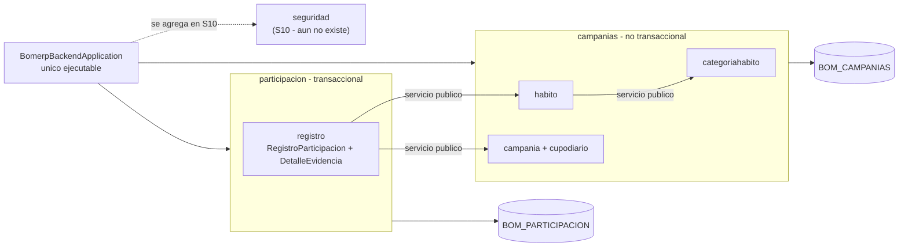
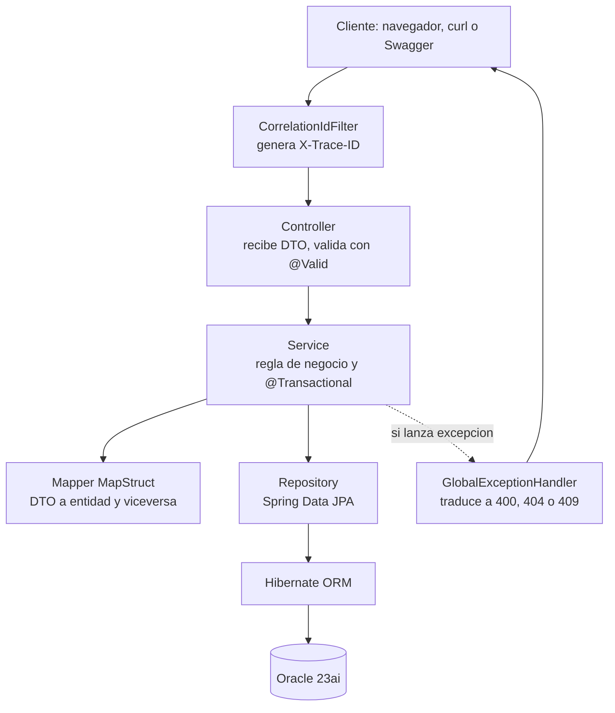

# LP2 - Producto de Unidad 1

**Proyecto:** Semestre Saludable UPeU
**Autor:** Montalvo Machaca, Maykol Gabriel
**Curso:** Lenguaje de Programación II — UPeU sede Juliaca — Sección g2 — Semestre 2026-2
**Repositorio:** [MGMM7STA/bomerp-backend](https://github.com/MGMM7STA)

## Producto

**Backend REST modular ensamblado como una sola aplicación Spring Boot, conectado a Oracle 23ai, con persistencia ORM, CRUD, una operación cabecera–detalle transaccional, consultas con filtros y agregaciones, CORS por propiedad, logs correlacionados y pruebas automáticas.**

El dominio es **Semestre Saludable UPeU**: una campaña institucional en la que el estudiante registra evidencias diarias de hábitos saludables (alimentación, descanso, actividad física, hidratación) y acumula puntaje. El backend se organiza como monolito modular con dos módulos propios:

| Módulo | Tipo | Contenido en U1 |
|---|---|---|
| `campanias` | No transaccional | Catálogo maestro: categorías de hábito, hábitos y campañas con su cupo diario. |
| `participacion` | Transaccional | Registro de participación con sus evidencias (cabecera–detalle), consumo de cupo y consultas. |

Los módulos `catalogo` y `ventas` son el ejemplo guiado que el docente desarrolló en las sesiones S1–S4; permanecen en el repositorio como referencia de aprendizaje y no forman parte del dominio de Semestre Saludable. La sustentación se realiza sobre `campanias` y `participacion`.

La autenticación JWT y la entidad `Estudiante` no forman parte de U1: el módulo `seguridad` se implementa en S10, tal como establece el brief del proyecto y la decisión registrada en ADR-004. Por eso `estudianteId` viaja como identificador simple, sin tabla ni clave foránea propia en este corte.

## 1. Alcance arquitectónico del corte

```text
bomerp-backend/                  # un solo proyecto Maven, sin reactor multi-modulo
└── src/main/java/pe/edu/upeu/bomerp/
    ├── BomerpBackendApplication.java   # unico Spring Boot ejecutable
    ├── CorsConfig.java                 # CORS por propiedad externa
    ├── OpenApiConfig.java              # documentacion de API
    ├── filter/                         # CorrelationIdFilter (X-Trace-ID)
    ├── exception/                      # manejo global de errores
    ├── campanias/                      # MODULO PROPIO - no transaccional
    │   ├── categoriahabito/            # agregado raiz: CategoriaHabito
    │   ├── habito/                     # agregado raiz: Habito
    │   └── campania/                   # agregado raiz: Campania + CupoDiario
    ├── participacion/                  # MODULO PROPIO - transaccional
    │   └── registro/                   # agregado raiz: RegistroParticipacion + DetalleEvidencia
    ├── catalogo/                       # ejemplo guiado del docente (S1-S3)
    ├── ventas/                         # ejemplo guiado del docente (S4-S5)
    └── seguridad/                      # se implementa en S10 (aun no existe como paquete)
```

Cada paquete directo bajo `pe.edu.upeu.bomerp` es un **módulo de aplicación** de Spring Modulith, no un artefacto Maven separado. Dentro de cada módulo, cada subpaquete es un **agregado** con identidad y ciclo de vida propios, y dentro de cada agregado están las capas (`entity`, `dto`, `mapper`, `repository`, `service`, `controller`).

`DetalleEvidencia` no tiene paquete propio: vive dentro de `registro` porque no tiene ciclo de vida independiente — no se crea, consulta ni elimina sin su registro padre.

Los límites no dependen de la disciplina del programador: están declarados con `@NamedInterface` sobre los paquetes `dto` y `service`, y verificados automáticamente por `ModularityTests`. Un módulo que intente usar el `repository` o la `entity` de otro rompe la compilación de las pruebas.

## 2. Demo ejecutable

| Recurso | URL local |
|---|---|
| Documentación interactiva de la API | `http://localhost:8080/swagger-ui.html` |
| Contrato OpenAPI en JSON | `http://localhost:8080/v3/api-docs` |
| Verificación de estado | `http://localhost:8080/actuator/health` |
| Página de prueba de CORS | `origen-prueba/index.html` (abierta con `file://`) |

## 3. Contrato REST

**Tabla 1. Contrato REST implementado**

| Método | Endpoint | Propósito | Sesión |
|---|---|---|---|
| `GET` | `/api/v1/categorias-habito` | Listar las categorías de hábito. | S2 |
| `GET` | `/api/v1/categorias-habito/{id}` | Consultar una categoría. | S2 |
| `POST` | `/api/v1/categorias-habito` | Registrar una categoría. | S2 |
| `PUT` | `/api/v1/categorias-habito/{id}` | Actualizar una categoría. | S2 |
| `DELETE` | `/api/v1/categorias-habito/{id}` | Eliminar una categoría sin hábitos asociados. | S2 |
| `GET` | `/api/v1/habitos` | Listar hábitos con su categoría anidada. | S3 |
| `GET` | `/api/v1/habitos?categoriaId={id}` | Filtrar hábitos por categoría. | S3 |
| `GET` | `/api/v1/habitos/{id}` | Consultar un hábito con su categoría. | S3 |
| `POST` | `/api/v1/habitos` | Registrar un hábito validando que la categoría exista. | S3 |
| `PUT` | `/api/v1/habitos/{id}` | Actualizar un hábito y reasignar su categoría. | S3 |
| `DELETE` | `/api/v1/habitos/{id}` | Eliminar un hábito. | S3 |
| `GET` | `/api/v1/campanias` | Listar campañas. | S2 |
| `GET` | `/api/v1/campanias/activa` | Devolver la campaña vigente con su cupo diario. | S2 |
| `POST` | `/api/v1/campanias` | Registrar una campaña validando fechas y unicidad de campaña activa. | S2 |
| `PUT` | `/api/v1/campanias/{id}` | Actualizar una campaña. | S2 |
| `DELETE` | `/api/v1/campanias/{id}` | Eliminar una campaña sin participación registrada. | S2 |
| `POST` | `/api/v1/participacion/registros` | Registrar la participación diaria con sus evidencias, de forma atómica. | S4 |
| `GET` | `/api/v1/participacion/registros` | Consultar registros con cuatro filtros combinables y ordenamiento. | S5 |
| `GET` | `/api/v1/participacion/registros/resumen` | Devolver el reporte agregado con proyección resumida. | S5 |
| `GET` | `/api/v1/participacion/registros/{id}` | Consultar un registro con todas sus evidencias. | S4 |

### Códigos de estado y su significado de negocio

**Tabla 2. Respuestas de error implementadas**

| Código | Excepción | Cuándo ocurre |
|---|---|---|
| `400 Bad Request` | `MethodArgumentNotValidException` | El cuerpo enviado viola una validación de formato (`@NotBlank`, `@Positive`, `@Pattern`). |
| `400 Bad Request` | `IllegalArgumentException` | Se pide ordenar por un campo fuera de la lista blanca, o la fecha fin no es posterior a la de inicio. |
| `404 Not Found` | `ResourceNotFoundException` | Se referencia un recurso inexistente (categoría, hábito, campaña o registro). |
| `409 Conflict` | `ReferenciaEnUsoException` | Se intenta borrar una categoría con hábitos, una campaña con participación, o activar una segunda campaña. |
| `409 Conflict` | `CupoDiarioExcedidoException` | El estudiante supera el máximo de evidencias diarias que permite la campaña. |

La distinción es deliberada: `400` significa *"lo que enviaste está mal escrito"*; `409` significa *"lo que enviaste está bien escrito, pero el estado actual del negocio no lo permite"*. Cada respuesta de error viaja con el mismo cuerpo (`error`, `message`, `timestamp`, `status`) y con la cabecera `X-Trace-ID` que la enlaza con la línea exacta del log.

## 4. DTO principales

Cada recurso tiene un DTO de entrada distinto del de salida. No se reutiliza uno solo porque lo que el cliente **puede enviar** y lo que el servidor **debe devolver** no coinciden: el cliente nunca envía `id`, `fecha`, `estado`, `puntajeTotal` ni `subtotal` — todos esos los calcula el servidor. Reutilizar un DTO abriría la puerta a que un cliente se auto-asigne el puntaje.

**Entrada de la operación cabecera–detalle** — `POST /api/v1/participacion/registros`

```json
{
  "estudianteId": 1,
  "detalles": [
    { "habitoId": 1, "veces": 2, "descripcion": "Caminata al campus", "urlImagen": "https://ejemplo/img1.jpg" },
    { "habitoId": 2, "veces": 1, "descripcion": "Ensalada de frutas", "urlImagen": "https://ejemplo/img2.jpg" }
  ]
}
```

**Salida de la operación cabecera–detalle** — `201 Created`

```json
{
  "id": 10,
  "estudianteId": 1,
  "campaniaId": 1,
  "fecha": "2026-09-13T21:40:12",
  "estado": "ENVIADO",
  "totalEvidencias": 3,
  "puntajeTotal": 3.00,
  "detalles": [
    { "habitoId": 1, "nombreHabito": "Caminata de 30 minutos", "descripcion": "Caminata al campus", "urlImagen": "https://ejemplo/img1.jpg", "puntajeUnitario": 1.00, "veces": 2, "subtotal": 2.00 },
    { "habitoId": 2, "nombreHabito": "Consumo de frutas", "descripcion": "Ensalada de frutas", "urlImagen": "https://ejemplo/img2.jpg", "puntajeUnitario": 1.00, "veces": 1, "subtotal": 1.00 }
  ]
}
```

`nombreHabito` y `puntajeUnitario` se **copian** dentro del detalle en el momento del registro. No se leen del hábito al consultar. Si mañana el hábito cambia de nombre o de puntaje, los registros ya emitidos conservan el valor que tenían el día que ocurrieron. Es el mismo principio por el que una boleta guarda el precio del día de la venta.

**Objeto relacionado** — `GET /api/v1/habitos`

```json
[
  {
    "id": 1,
    "nombre": "Caminata de 30 minutos",
    "descripcion": "Caminata continua de al menos 30 minutos",
    "puntajeBase": 1,
    "activo": 1,
    "categoria": { "id": 3, "nombre": "Actividad fisica" }
  }
]
```

La categoría viaja como `CategoriaHabitoResumen` — solo `id` y `nombre` — y no como la entidad completa. Eso corta la navegación en un nivel: el hábito muestra su categoría, pero la categoría no devuelve la lista de sus hábitos. Sin ese corte, serializar cualquiera de los dos entraría en un ciclo infinito.

**Reporte agregado** — `GET /api/v1/participacion/registros/resumen`

```json
{
  "agregado": {
    "totalRegistros": 9,
    "evidenciasTotales": 22,
    "puntajeTotal": 27.00,
    "puntajePromedio": 3.00
  },
  "registros": [
    { "id": 9, "estudianteId": 3, "fecha": "2026-09-12T08:30:00", "estado": "APROBADO", "totalEvidencias": 3, "puntajeTotal": 4.00, "cantidadDetalles": 2 }
  ]
}
```

`puntajePromedio` se calcula en Java, no en la consulta. JPQL devuelve siempre `Double` para `AVG`, y un promedio de puntajes debe ser exacto: se calcula con `BigDecimal` y `RoundingMode.HALF_UP`.

## 5. Arquitectura backend U1

**Figura 1. Módulos, esquemas y dependencias**



Todos los módulos corren en la misma JVM y comparten un solo datasource. No existe Feign ni comunicación HTTP interna. `participacion` llama a `campanias` a través de sus interfaces `HabitoService` y `CampaniaService` — nunca a sus repositorios ni a sus entidades.

**Figura 2. Recorrido de una petición**



El controller no sabe consultar la base de datos y el repositorio no sabe de reglas de negocio. Esa separación es la que permite cambiar Oracle por otro motor tocando una sola capa.

## 6. Casos de prueba

**Tabla 3. Casos verificados en vivo**

| # | Caso | Acción | Resultado obtenido |
|---:|---|---|---|
| 1 | Backend operativo | Arrancar con el perfil `dev`. | Conecta con Oracle 23ai (`FREEPDB1`) y arranca sin errores. |
| 2 | Límites de módulos | `mvnw test` → `ModularityTests`. | 2 pruebas en verde: ningún módulo accede al repositorio de otro. |
| 3 | Validación de esquema | `ddl-auto: validate` al arrancar. | La aplicación se niega a arrancar si una entidad no tiene su tabla real en Oracle. |
| 4 | CRUD — crear | `POST /categorias-habito` con datos válidos. | `201 Created` con el `id` asignado. |
| 5 | CRUD — listar | `GET /categorias-habito`. | Las 4 categorías del catálogo. |
| 6 | CRUD — eliminar libre | `DELETE /categorias-habito/5` (sin hábitos). | `204 No Content`. |
| 7 | CRUD — eliminar bloqueado | `DELETE /categorias-habito/1` (con hábitos). | `409 Conflict`: *"No se puede eliminar la categoría 'Alimentacion': tiene 1 habito(s) asociado(s)"*. |
| 8 | Objeto relacionado | `GET /habitos`. | Cada hábito con su categoría anidada, sin ciclo de serialización. |
| 9 | Filtro por relación | `GET /habitos?categoriaId=1`. | Solo el hábito de esa categoría. |
| 10 | Referencia inválida | `POST /habitos` con `categoriaId: 999`. | `404 Not Found`: *"Categoria de habito no encontrada: 999"*. |
| 11 | Cabecera–detalle éxito | `POST /participacion/registros` con dos evidencias. | `201 Created`: cabecera, detalles, subtotales y puntaje total consistentes. |
| 12 | Cabecera–detalle rollback | `POST` que excede el cupo diario de la campaña. | `409 Conflict` y **cero** filas persistidas: ni cabecera, ni detalles, ni consumo de cupo. |
| 13 | Filtros combinados | `GET /participacion/registros?estado=APROBADO&estudianteId=1&desde=...&hasta=...`. | Solo los registros que cumplen los cuatro criterios a la vez. |
| 14 | Ordenamiento inválido | `GET /participacion/registros?ordenarPor=cantidadDetalles`. | `400 Bad Request` con el mensaje de la lista blanca, sin filtrar detalles internos. |
| 15 | Reporte agregado | `GET /participacion/registros/resumen`. | Totales, promedio calculado en `BigDecimal` y proyección resumida. |
| 16 | CORS bloqueado | Página `file://` contra la API desde Chrome. | El navegador bloquea la respuesta: el origen no está en la lista. |
| 17 | CORS permitido | Misma página desde un origen autorizado por propiedad. | La respuesta se entrega al JavaScript de la página. |

El caso 12 es el que demuestra atomicidad. `@Transactional` sobre `crear()` hace que el fallo en la evidencia número dos revierta también la cabecera y la primera evidencia, aunque ya estuvieran escritas en la sesión de Hibernate. Sin esa anotación quedaría un registro a medias, con puntaje cobrado y evidencia faltante.

El caso 16 es el que demuestra que CORS es una restricción **del navegador**, no del servidor: la misma petición hecha con `curl` devuelve `200` y los datos completos, porque `curl` no aplica la política de mismo origen. El servidor siempre ejecuta la petición; lo que hace CORS es decirle al navegador si tiene permiso de **entregar** la respuesta al JavaScript que la pidió.

## 7. Trazabilidad con ADS y BD2

**Tabla 4. Trazabilidad entre los tres cursos**

| Elemento LP2 | ADS | BD2 |
|---|---|---|
| Un solo ejecutable con configuración externa por perfil (`dev`) | Vista de despliegue: un contenedor de aplicación y uno de base de datos | Credenciales fuera del código, Oracle 23ai en Docker |
| Monolito modular `campanias` / `participacion` con límites verificados | Vista C3 de componentes: contenedor Backend API y sus componentes internos | Esquemas `BOM_CAMPANIAS` y `BOM_PARTICIPACION` con propiedad funcional separada |
| Relación `Habito` → `CategoriaHabito` con DTO resumido | Modelo de dominio: entidad Hábito clasificada por categoría | `FK_HABITO_CATEGORIA`, `ID_CATEGORIA NOT NULL`, `UK_CATEGORIA_HABITO_NOMBRE` |
| Operación cabecera–detalle atómica del registro de participación | Requisito funcional: el estudiante registra sus evidencias diarias | `REGISTROS` / `DETALLE_EVIDENCIAS` con FK e integridad referencial |
| Cupo diario por estudiante y campaña | Requisito no funcional: control de abuso del registro | `CUPOS_DIARIOS` con clave única por campaña, estudiante y fecha |
| Filtros por estado y rango de fecha | Requisito no funcional de rendimiento en consultas | Índice sobre `FECHA` en `REGISTROS` |
| `409` al borrar una categoría en uso | Regla de integridad del modelo de dominio | La FK de Oracle impide el borrado; el backend lo traduce a un mensaje de negocio |

La última fila es la que conviene explicar en vivo: la base de datos ya impide el borrado por sí sola, pero devolvería un `ORA-02292` que ningún usuario entiende. El backend consulta primero, detecta la condición y responde con una frase que dice qué pasó y qué hacer. La integridad se defiende en las dos capas, no en una sola.

## 8. Rúbrica de evaluación

**Tabla 5. Rúbrica de la Unidad 1 y evidencia presentada**

| Criterio | Peso | Evidencia en este proyecto |
|---|---:|---|
| 1. Proyecto backend con ORM, conexión, recurso REST, DTO y documentación de API | 16% | Proyecto Maven único, Spring Boot 4.0.7 sobre Java 21, Hibernate contra Oracle 23ai, `swagger-ui.html` y `/v3/api-docs` vivos, versionado `/api/v1`. |
| 2. CRUD REST completo con validaciones, excepciones, logs y pruebas | 16% | CRUD de `categorias-habito` y `habitos` (casos 4–7, 10), `GlobalExceptionHandler` con 5 traducciones, `X-Trace-ID` en cada respuesta, 7 pruebas en verde. |
| 3. Objetos relacionados mediante ORM, DTO y reglas de asociación | 16% | `Habito` → `CategoriaHabito` con `@ManyToOne`, DTO resumido que corta el ciclo, filtro por relación y `409` al borrar una categoría en uso (casos 7–10). |
| 4. Operación cabecera-detalle con registro atómico, cálculos, estados, commit y rollback | 16% | `POST /participacion/registros` con cálculo de subtotales y puntaje, estado `ENVIADO`, y rollback completo por cupo excedido (casos 11–12). |
| 5. Consultas, filtros, ordenamiento, agregaciones, reportes y CORS | 16% | Cuatro filtros combinables con `(:param IS NULL OR ...)`, orden con lista blanca, proyección por constructor, reporte agregado y CORS por propiedad externa (casos 13–17). |
| 6. Sustentación | 20% | Presentación de 8 min, demo en vivo de 5 min y respuestas individuales. |

## 9. Trazabilidad y procedencia

Los cinco primeros criterios son cita literal del resultado de aprendizaje de la Unidad I del sílabo de LP2 y corresponden a la porción de backend REST del **Nivel 2 de CE023 (Programación)**. La otra porción de ese nivel — frontend SPA, seguridad JWT e integración full-stack — se completa en la Unidad 2. El criterio 6 corresponde a la sustentación exigida por el sílabo (sesión 6, actividad 2) y verifica competencia general, no CE023.

**Alcance declarado como pendiente.** Tres reglas del módulo `participacion` quedan documentadas y no implementadas en este corte: rechazo de hábito duplicado dentro del mismo registro, recálculo del puntaje al rechazar un registro, y validación de evidencias fuera del rango de fechas de la campaña. La entidad `Estudiante` y el módulo `seguridad` están diferidos a S10 por decisión del brief y de ADR-004, no por omisión. Se declaran aquí porque la honestidad sobre el alcance forma parte de lo que se sustenta.
